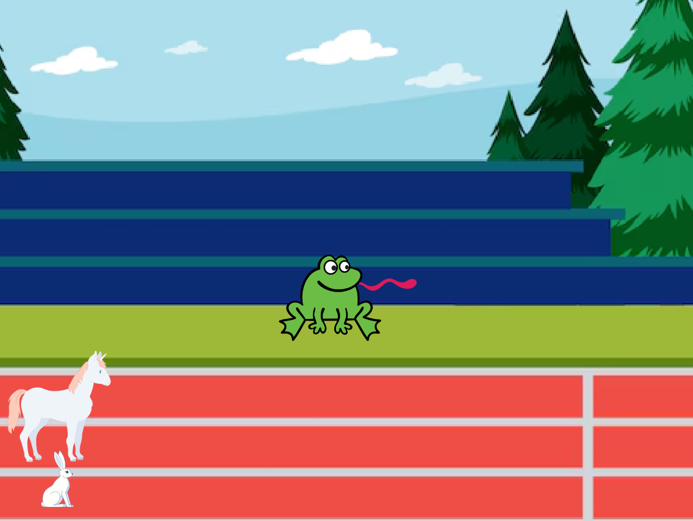
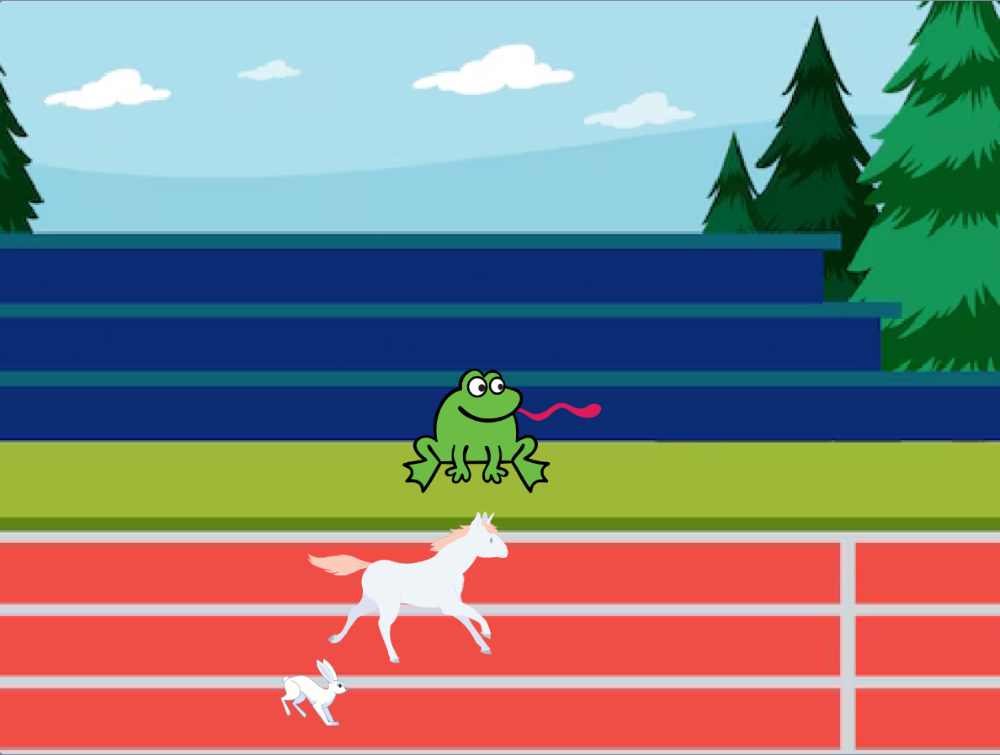
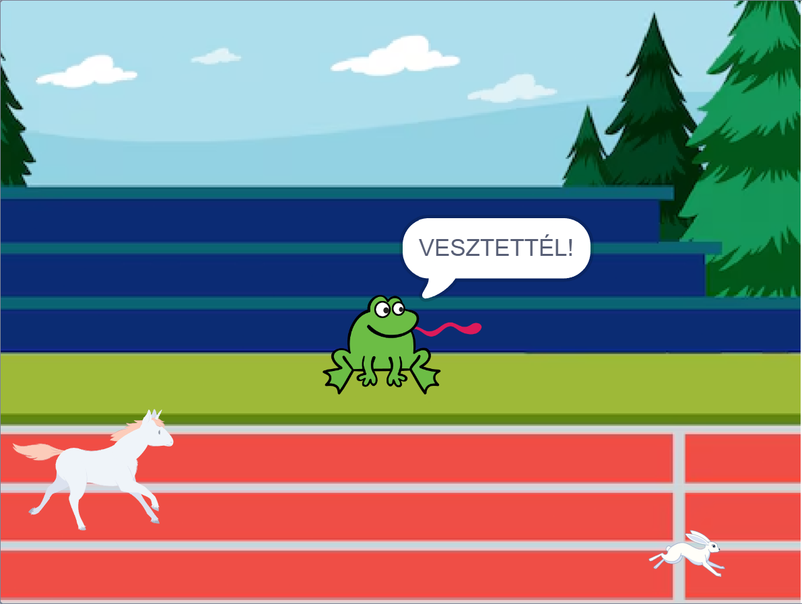

# Állati Futóverseny - Scratch Projekt

https://scratch.mit.edu/projects/1149050550/

---

Ez egy egyszerű, azonban szórakoztató kis játék, amelyben egy **ló** és egy **nyúl** versenyeznek egymással. A játék célja az, hogy a ló vagy a nyúl minél gyorsabban érjék el a célvonalat.

---

## A Játék Működése
   - A ló a játékos által irányított karakter. A space gomb megnyomásával lép előre.
   - A nyúl automatikusan mozog, és versenyez a lóval.
   - A bíró visszaszámlál 3 másodpercig, majd elindítja a versenyt,  a végén pedig bejelenti a győztest.

---

## Képernyőképek

---

---

